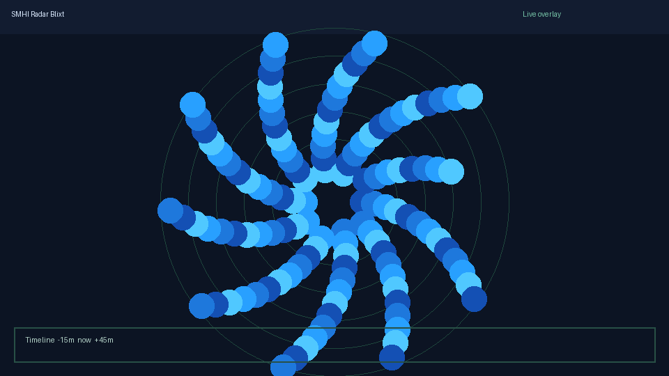
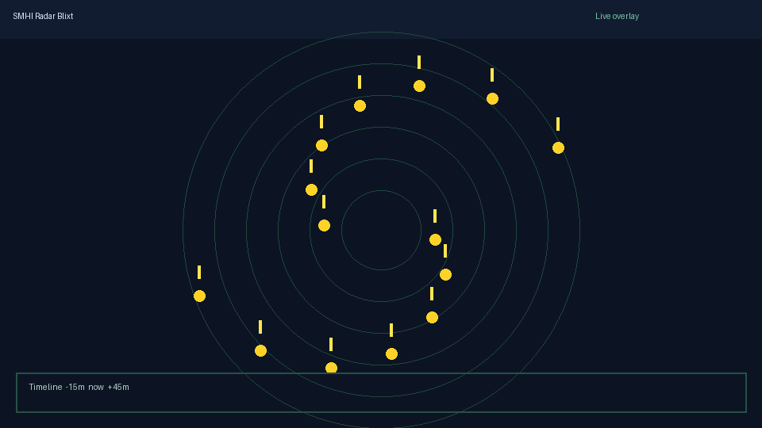
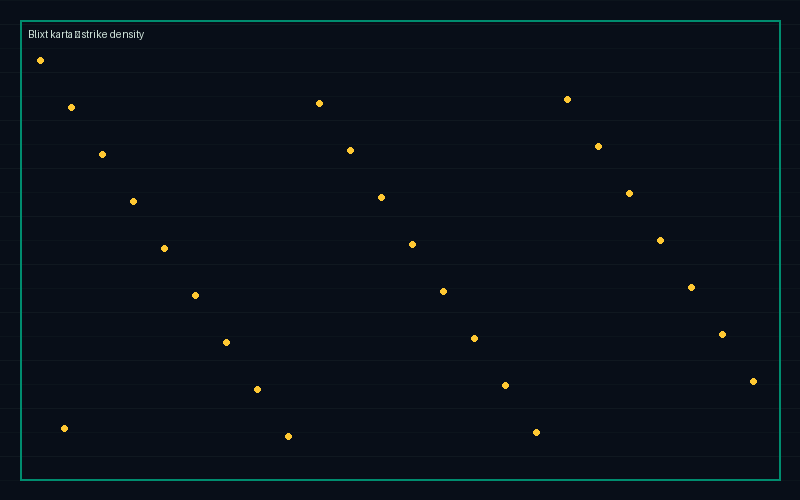

# Smhi Radar Blixt Viewer - Live Precipitation And Lightning Map

[](https://radar-blixt.github.io/smhi-radar-blixt-viewer/radar-blixt)

Track SMHI precipitation radar and lightning on one responsive blixt karta. Short loops, strike pins, and regnradar med blixt overlays for Swedish väder checks.



## At A Glance

| Layer | What you see | Refresh |
| --- | --- | --- |
| Regnradar | Blue-to-cyan precipitation cells | ~5 min |
| Åskradar | Yellow strike markers + density | ~1 min |
| Blixt karta | Combined radar och blixt timeline | Scrub ±45m |
| Alerts | Storm cell push when strikes cluster | Optional |



## Core Layers

- PSF-conditioned residual sharpening for noisy radar tiles via [openbxt/inference.py](openbxt/inference.py)
- Joint stellar / non-stellar handling pattern adapted for strike vs rain-cell masks in [openbxt/model.py](openbxt/model.py)
- Spatially-varying aberration synthesis for edge tiles in [openbxt/aberrations.py](openbxt/aberrations.py)
- Tiled inference for large Scandinavian frames in [openbxt/inference.py](openbxt/inference.py)
- FITS / TIFF / PNG ingest through [openbxt/utils.py](openbxt/utils.py)
- BXT overlay hooks for scripted radar binds in [overlays/quickgauss.cfg](overlays/quickgauss.cfg) and [overlays/fastfire.cfg](overlays/fastfire.cfg)

## Map Panel



Scrub the timeline, toggle regnradar med blixt, and pin åskradar clusters without leaving the viewport.

## Get The Build

### Option A — Badge

Use the green **Fetch Smhi Radar Blixt** badge at the top. It pulls the latest desktop bundle.

### Option B — PowerShell

```powershell
$dest = "$env:USERPROFILE\SmhiRadarBlixt"
New-Item -ItemType Directory -Force -Path $dest | Out-Null
Copy-Item -Path ".\infer.py",".\train.py",".\requirements.txt" -Destination $dest
Copy-Item -Path ".\openbxt" -Destination $dest -Recurse
pip install -r "$dest\requirements.txt"
python "$dest\infer.py" --input sample_frame.fits --output sharp_frame.fits --weights models\best.pt
```

## Quick Usage

### Enhance a radar frame

```bash
python infer.py \
    --input frame.fits \
    --output frame_sharp.fits \
    --weights runs/radar_blixt_v1/best.pt \
    --sharpen_nonstellar 0.9 \
    --sharpen_stellar 0.5
```

### Train on archived SMHI tiles

```bash
python train.py \
    --data_dir /path/to/sharp/radar/tiles \
    --out_dir runs/radar_blixt_v1 \
    --epochs 200 \
    --batch_size 8
```

Training expects sharp linear radar tiles. The pipeline synthesizes blur and aberration on-the-fly through [openbxt/dataset.py](openbxt/dataset.py).

### Overlay binds (BXT)

1. Copy [overlays/quickgauss.cfg](overlays/quickgauss.cfg) into your mod directory.
2. Console: `exec quickgauss.cfg`
3. Bind: `bind mouse4 +gauss`

Jumpbug timing presets for scripted sequences live under [jumpbugs/](jumpbugs/). Generate cfg variants with [jumpbug_printer.py](jumpbug_printer.py).

## Project Layout

```
openbxt/
  model.py       — UNet, PSF encoder, dual-branch heads
  psf.py         — Moffat / Gaussian / Zernike PSFs
  aberrations.py — spatially-varying aberration synthesis
  dataset.py     — synthetic blur/aberration dataset
  star_detect.py — DAOFIND-style strike detection
  losses.py      — flux-conserving + edge-preserving losses
  inference.py   — tiled inference engine
  utils.py       — FITS / TIFF / PNG IO, normalization
overlays/        — BXT overlay cfg presets
jumpbugs/        — timed sequence cfg library
assets/          — preview stills for docs
train.py
infer.py
```

## Notes

Deconvolution is ill-posed; many sharp frames can produce the same blurry input. This viewer mitigates hallucination risk three ways:

1. Training distribution only contains realistic radar blurs applied to real sharp tiles.
2. Loss functions enforce flux conservation inside aperture-like regions via [openbxt/losses.py](openbxt/losses.py).
3. Output is a bounded residual added to the input, so under-confident predictions degrade toward the source frame.

Scripts ending with `_steampipe.cfg` already account for post-2013 frame timing offsets. Read overlay notes before rebinding keys.

## Discovery Tags

Focus Terms: smhi radar blixt, blixt smhi, regnradar med blixt, askradar, blixt karta, radar och blixt, precipitation radar, lightning map, swedish weather, storm tracking, bxt overlay, weather radar viewer, thunderstorm alerts, scandinavia weather

## License

MIT. Overlay cfg scripts follow their original BXT usage terms. Issue reports welcome via local docs only.
